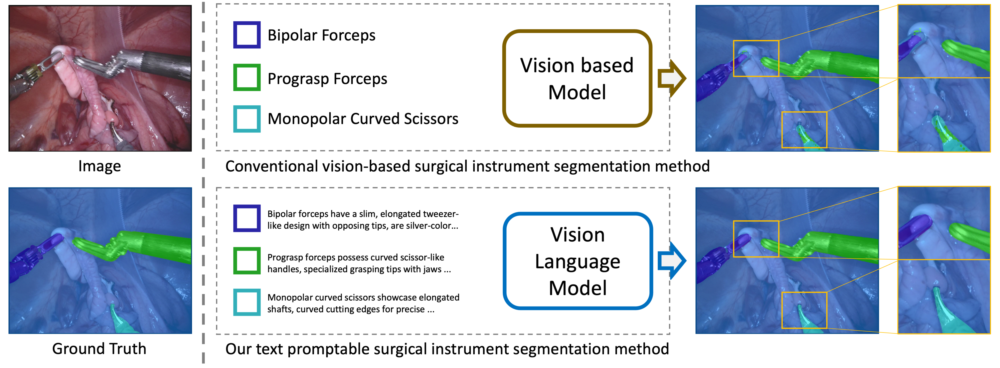
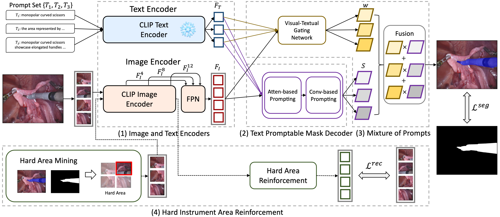
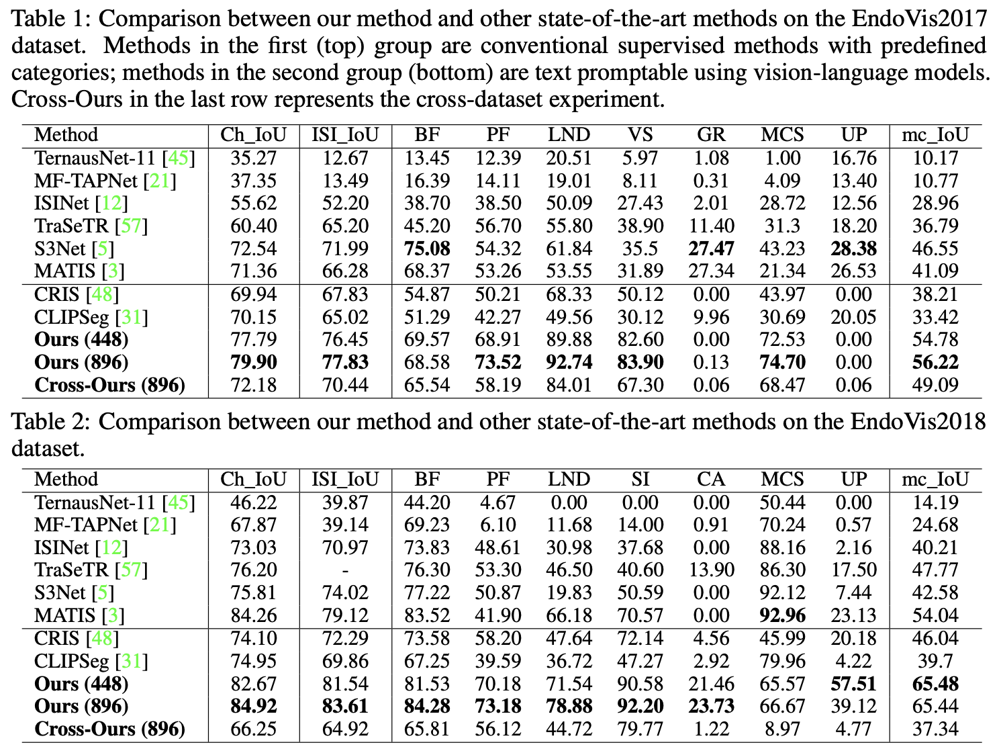

# Text Promptable Surgical Instrument Segmentation with Vision-Language Models

NeurIPS 2023, official code implementation, [arXiv](https://arxiv.org/abs/2306.09244)

## Abstract

In this paper, we propose a novel text promptable surgical instrument segmentation approach to overcome challenges associated with diversity and differentiation of surgical instruments in minimally invasive surgeries. We redefine the task as text promptable, thereby enabling a more nuanced comprehension of surgical instruments and adaptability to new instrument types. Inspired by recent advancements in vision-language models, we leverage pretrained image and text encoders as our model backbone and design a text promptable mask decoder consisting of attention- and convolution-based prompting schemes for surgical instrument segmentation prediction. Our model leverages multiple text prompts for each surgical instrument through a new mixture of prompts mechanism, resulting in enhanced segmentation performance. Additionally, we introduce a hard instrument area reinforcement module to improve image feature comprehension and segmentation precision. Extensive experiments on EndoVis2017 and EndoVis2018 datasets demonstrate our model's superior performance and promising generalization capability. To our knowledge, this is the first implementation of a promptable approach to surgical instrument segmentation, offering significant potential for practical application in the field of robotic-assisted surgery.


## Method

An overview of our method.
Our method comprises four key modules:
1) image and text encoders derived from the pretrained vision-language model to obtain visual and textual features;
2) a text promptable mask decoder consisting of attention- and convolution-based prompting schemes for predicting the score map from image features through text prompts;
3) a mixture of prompts mechanism that utilizes a visual-textual gating network to produce pixel-wise weights for merging different score maps;
4) a hard instrument area reinforcement module to reinforce image representation learning specifically on hard-predicted area.


## Results

In Table 1 and Table 2, we compare our method with a series of state of the art methods on the EndoVis2017 and EndoVis2018 datasets, respectively.
The methods can be divided into two group depending on whether they have utilized textural prompts for surgical instruments.
Ours belongs to the second group.
As demonstrated by the results, our method significantly surpasses the state of the art in the first group: e.g. on the EndoVis2017 dataset, +7.36% on Ch_IoU, +5.84% in ISI_IoU, and +9.67% in mc_IoU.
Particularly, a smaller difference between Ch_IoU and ISI_IoU for our method indicates it has fewer misclassified categories compared to other methods.
Next, comparing to methods in second group, which are originally designed for natural image segmentation, our method yields clearly superior results, validating the effectiveness of our specifically tailored modules for surgical instrument segmentation.


## Usage

### Prepare Dataset
Follow ```tools/prepare_[dataset].py```

### Train
```
PYTHONPATH="$(dirname $0)/..":$PYTHONPATH \
python train.py \
  --config $CONFIG
```

### Test
```
python test.py \
  --config $CONFIG \
  --opts TEST.visualize True
```

### Evaluation
```
echo "eval binary ..."
python evaluate_2018.py \
  --test_path ${test_path} \
  --pred_path ${pred_path} \
  --problem_type binary

echo "eval parts ..."
python evaluate_2018.py \
  --test_path ${test_path} \
  --pred_path ${pred_path} \
  --problem_type parts

echo "eval instruments ..."
python evaluate_2018.py \
  --test_path ${test_path} \
  --pred_path ${pred_path} \
  --problem_type instruments
```

## Acknowledgements
TP-SIS is developed based on [CRIS.pytorch](https://github.com/DerrickWang005/CRIS.pytorch).
Thanks for their great works!

## Citation
If you find this repository useful, please cite:

```
@article{zhou2023text,
  title={Text Promptable Surgical Instrument Segmentation with Vision-Language Models},
  author={Zhou, Zijian and Alabi, Oluwatosin and Wei, Meng and Vercauteren, Tom and Shi, Miaojing},
  journal={arXiv preprint arXiv:2306.09244},
  year={2023}
}
```